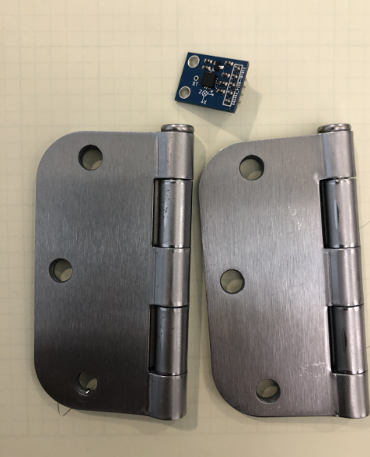
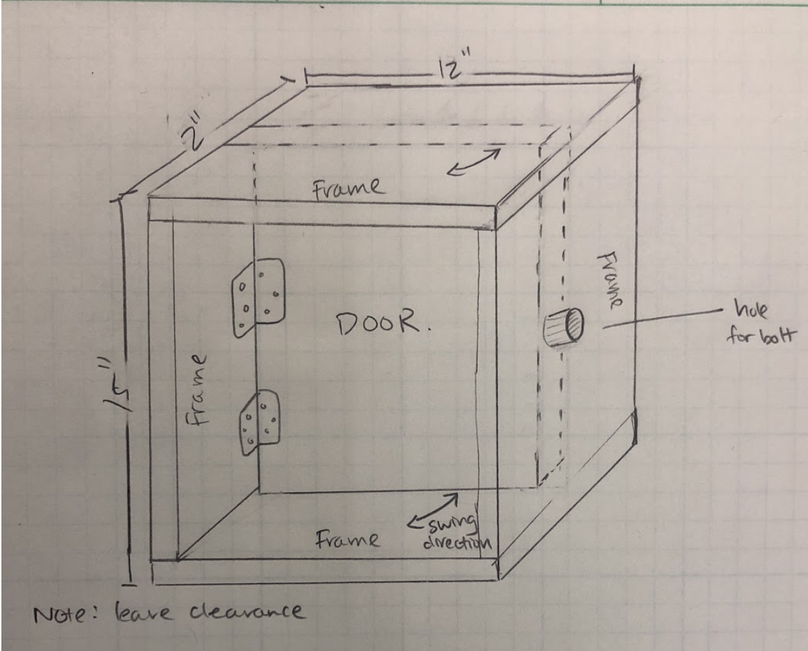
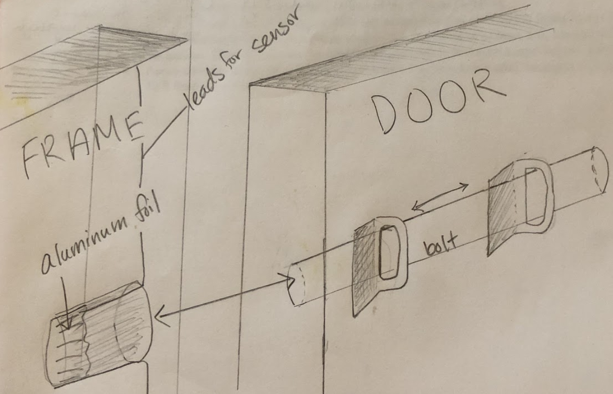

# Welcome to Smart Dorm/Home Security 

## 1. Current progress

We’ve procured all of the sensors we plan on using, to get an initial feel of what kind of readings/range of readings we can expect to get. The following was procured, along with 3.5’’ door hinges to build the model door for this project:

*Sensors needed*

Distance sensor: Ultrasonic Ranging Detector HC-SR04 [Tutorial](https://thepihut.com/blogs/raspberry-pi-tutorials/hc-sr04-ultrasonic-range-sensor-on-the-raspberry-pi)

Accelerometer sensor: ADXL 335 3 axis [Tutorial](https://www.abelectronics.co.uk/kb/article/28/adc-differential-pi-with-adxl335-accelerometer) [Tutorial2](https://www.abelectronics.co.uk/kb/article/28/adc-differential-pi-with-adxl335-accelerometer)

Photoresistor: comes with kit

Light sensor: comes with kit

  

figure1

